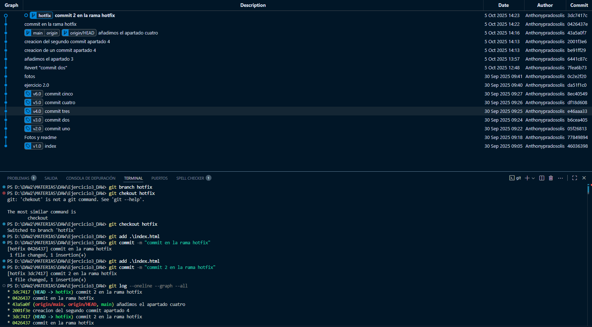

1: Documentación del proyecto

2: Creación de commits, tags y del log

3: Realizar un commit para volver al commit numero dos sin que desaparezca los commits posteriores

4: Crear varios commits para luego hacer un git log --oneline --graph --all

6: Crear una nueva rama hotfix

7 : Fusionar la rama hotfix cara main 

8: Crear otra rama development y fusionarla cara main

9: Realizar el paso anterior pero con rebase 

10: Mostrar como se realiza el rebase 

